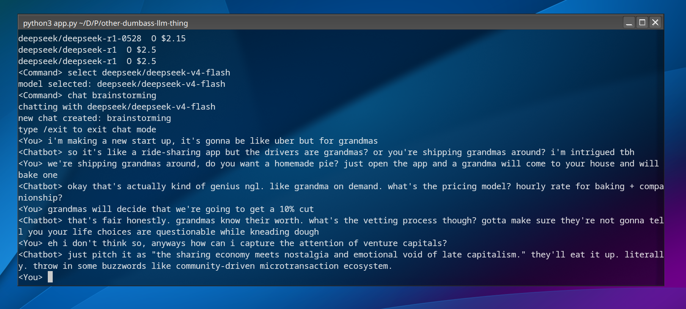

# stuipdID llm chat thing for hack ai
chat with openrouter models easily in terminal

by default endpoint is set to ai.hackclub.com

## Running
- install the package:
`pip install insertpackagenamehere` or `pipx install insertpackagenaemhere`
- run the package
- set your api key
`key yourkeyhere`
- select a model
`select openai/gpt-oss-20b:free`
- start chatting !
`chat`

## Commands
- `help` shows the commands available 
- `list :free` lists available models on endpoint, add a parameter to search (:free)
- `select deepseek/deepseek-v4-flash` selects model and updates config
- `endpoint openrouter` or `endpoint https://ai.hackclub.com/proxy/v1/` sets endpoint
- `key apikey` set your api key
- `lc` lists chats